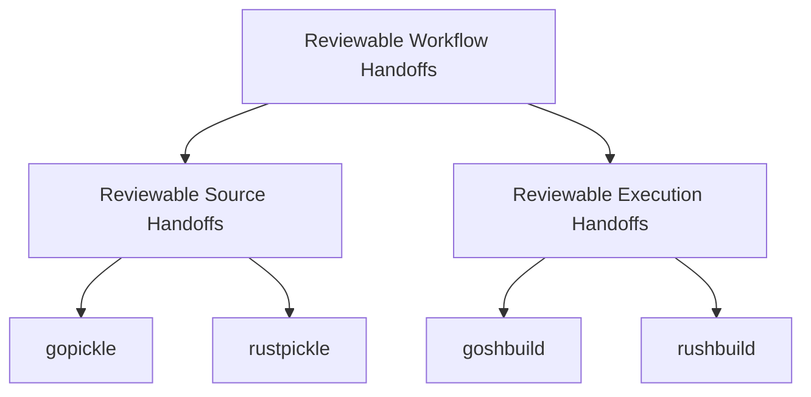

# Reviewable Workflow Handoffs

Reviewable source and execution handoffs for modern developer workflows.

Developer workflow handoffs should be visible, language-native where possible, version-controlled, and reviewable before they run or before another project consumes them.

> Do not execute what you cannot review.
> Do not bundle what you cannot inspect.

Reviewable Workflow Handoffs defines specs and reference tools for making developer handoffs inspectable before they cross a trust boundary.

| Handoff type | Go | Rust |
| --- | --- | --- |
| Source handoff | [`gopickle`](https://github.com/runplus-community/gopickle) | [`rustpickle`](https://github.com/runplus-community/rustpickle) |
| Execution handoff | [`goshbuild`](https://github.com/runplus-community/goshbuild) | [`rushbuild`](https://github.com/runplus-community/rushbuild) |

## Before / After

Before:

- source, dependency state, and build behavior are often scattered across README steps, local scripts, CI config, and tribal knowledge
- reviewers may not have one clear handoff artifact to inspect before another context consumes or runs it

After:

- source handoffs answer what files or dependency content another project will consume
- execution handoffs answer what commands, scripts, or runners will execute
- handoff changes can be reviewed in pull requests like other project changes

## Two Handoff Families

### Reviewable Source Handoffs

Source handoffs make project files and dependency content visible before another project, team, reviewer, or tool consumes them.

> Do not bundle what you cannot inspect.

Specs:

- [`GOPICKLE-001`](specs/source-handoffs/gopickle.md): Reviewable Go source handoffs
- [`RUSTPICKLE-001`](specs/source-handoffs/rustpickle.md): Reviewable Rust source handoffs

### Reviewable Execution Handoffs

Execution handoffs make commands and workflow behavior visible before they run locally or in CI.

> Do not execute what you cannot review.

Specs:

- [`GOSHB-001`](specs/execution-handoffs/goshbuild.md): Reviewable Go execution handoffs
- [`RUSHB-001`](specs/execution-handoffs/rushbuild.md): Reviewable Rust execution handoffs

## Concepts

- [Reviewable Workflow Handoffs](concepts/reviewable-workflow-handoffs.md)
- [Reviewable Source Handoffs](concepts/source-handoffs.md)
- [Reviewable Execution Handoffs](concepts/execution-handoffs.md)
- [Glossary](concepts/glossary.md)
- [What This Is Not](concepts/what-this-is-not.md)
- [Threat Model](concepts/threat-model.md)
- [Credible Claims](concepts/credible-claims.md)
- [Project Map](docs/project-map.md)
- [Examples](examples/README.md)
- [Review Plan](docs/review-plan.md)

## Principles

- [Principles index](principles/README.md)
- [Do Not Execute What You Cannot Review](principles/do-not-execute-what-you-cannot-review.md)
- [Do Not Bundle What You Cannot Inspect](principles/do-not-bundle-what-you-cannot-inspect.md)
- [Prefer Language-Native Handoffs](principles/prefer-language-native-handoffs.md)

## Case Studies

- [Case studies index](case-studies/README.md)
- [Axios 2026 npm Compromise](case-studies/axios-2026-npm-compromise.md)

## Community

- [Contributing](CONTRIBUTING.md)
- [Code of Conduct](CODE_OF_CONDUCT.md)
- [Security Policy](SECURITY.md)

## Repo Boundary

This repo is the spec and thesis layer. Runnable implementation code, demo apps, generated runners, smoke tests, and language-specific test harnesses belong in the supporting tool repos.

This repo may include specs, concepts, comparisons, launch docs, diagrams, and links to implementation evidence.

## Security Position

Reviewable Workflow Handoffs does not replace dependency scanning, code review, package signing, sandboxing, CI security, SLSA, OpenSSF Scorecard, Sigstore, SBOMs, or runtime policy enforcement.

It helps reduce hidden workflow behavior by making handoffs easier to inspect before execution or consumption.

See [comparisons/slsa-openssf.md](comparisons/slsa-openssf.md) for how this project relates to adjacent supply-chain security practices.

## License

MIT. See [LICENSE](LICENSE).
