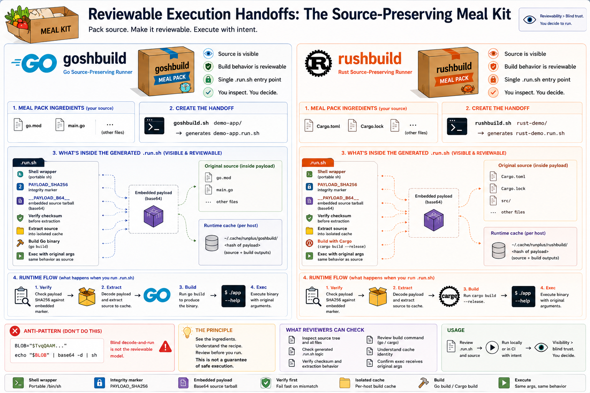

# Reviewable Execution Handoffs

An execution handoff answers:

> What commands or scripts are being handed to a machine, CI system, or developer shell?

Execution handoffs are about pre-execution reviewability. They make it easier to inspect commands, payloads, generated runners, build steps, and cache behavior before anything runs.

> Do not execute what you cannot review.

## Visual Model

This spec-level model shows the current Go and Rust execution-handoff reference lanes side by side. The meal kit represents a source-preserving runner: inspect the ingredients, verify the marker, build locally, then run with intent.

## Reference Implementations

| Language | Tool | Spec |
| --- | --- | --- |
| Go | [`goshbuild`](https://github.com/runplus-community/goshbuild) | [`GOSHB-001`](../specs/execution-handoffs/goshbuild.md) |
| Rust | [`rushbuild`](https://github.com/runplus-community/rushbuild) | [`RUSHB-001`](../specs/execution-handoffs/rushbuild.md) |

## Reviewability Goal

An execution handoff should make these visible:

- command path that will run
- shell workflow or generated runner
- source payload or source reference
- payload checksum or integrity marker
- extraction behavior
- build command
- cache identity
- generated output path

## Source-Preserving Execution

The initial `*shbuild` tools use a source-preserving runner model:

1. package source into a shell-visible handoff artifact
2. verify the payload before extraction
3. extract source into a controlled workspace
4. build with the local language toolchain
5. cache by source, platform, toolchain, and payload identity
6. execute the resulting binary with normal arguments

The point is not merely to generate a shell script. The point is to make the executable handoff carry a reviewable source and build story.

## Mental Model

An execution handoff should feel less like receiving a mystery binary and more like receiving a reviewable meal kit: inspect the ingredients, check the recipe, verify the seal, then cook locally.

In `goshbuild` and `rushbuild`, the ingredients are the source payload, the recipe is the runner/build workflow, the seal is the checksum, and cooking locally means building with the local Go or Rust toolchain before execution.

## Non-Goals

Execution handoffs do not guarantee safe execution.

They do not replace dependency scanning, package signing, provenance, SLSA, OpenSSF Scorecard, SBOMs, CI hardening, sandboxing, or normal code review.
