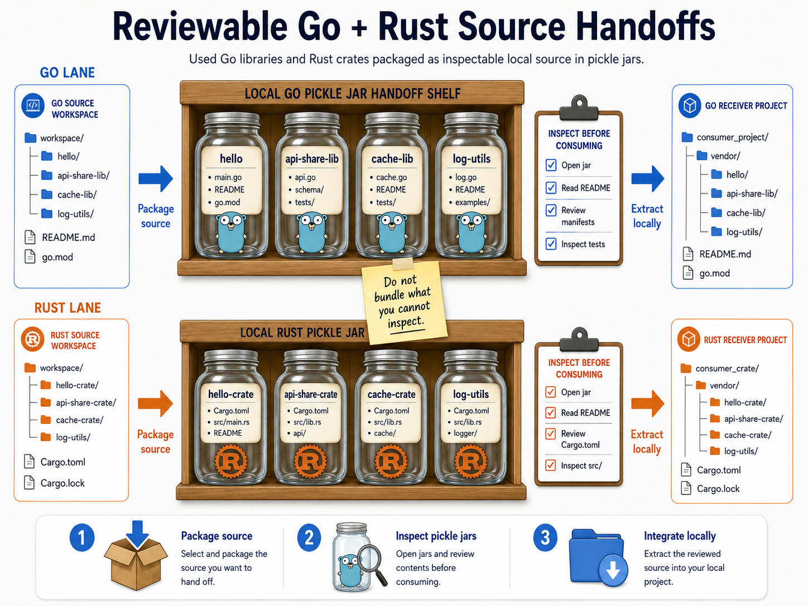

# Reviewable Source Handoffs

A source handoff answers:

> What files or source content are being handed to another tool, project, reviewer, or AI agent?

Source handoffs are about pre-consumption reviewability. They make it easier to inspect source content, generated local repository artifacts, and consumer configuration before another project, tool, reviewer, or AI agent uses them.

They answer the source side of the handoff question, not the execution side: what will be included, what will be excluded, how it will be identified, and how the receiver will consume it.

> Do not bundle what you cannot inspect.

## Visual Model

This spec-level model shows the current Go and Rust source-handoff reference lanes side by side. The pickle jars represent inspectable local source packages: open them, review the contents, then integrate locally through the language's normal project mechanisms.

## Reference Implementations

| Language | Tool | Spec |
| --- | --- | --- |
| Go | [`gopickle`](https://github.com/runplus-community/gopickle) | [`GOPICKLE-001`](../specs/source-handoffs/gopickle.md) |
| Rust | [`rustpickle`](https://github.com/runplus-community/rustpickle) | [`RUSTPICKLE-001`](../specs/source-handoffs/rustpickle.md) |

## Reviewability Goal

A source handoff should make these visible:

- source root or manifest being exposed
- included files
- excluded files
- version or identity assigned to the handoff
- generated local repository layout
- metadata or manifest files
- consumer configuration

## Language-Native Handoffs

Reviewable source handoffs should prefer language-native mechanisms when they exist.

Examples:

- Go: file-backed `GOPROXY`
- Rust: Cargo directory source or `[patch.crates-io]`

Language-native handoffs let consumer projects keep familiar dependency behavior while making the local source flow easier to inspect.

## Mental Model

A source handoff is like putting local library code into transparent, labeled pickle jars on a shelf: the contents are visible, the identity is marked, and another project can inspect the jar before consuming it.

`gopickle` and `rustpickle` are the source-handoff reference tools for this model. They make source packages easier to inspect before another project consumes them through Go or Rust-native configuration.

## Non-Goals

Source handoffs do not prove that source is safe.

They do not replace source review, dependency scanning, signing, provenance, SBOMs, CI hardening, sandboxing, or normal maintainer judgment.
